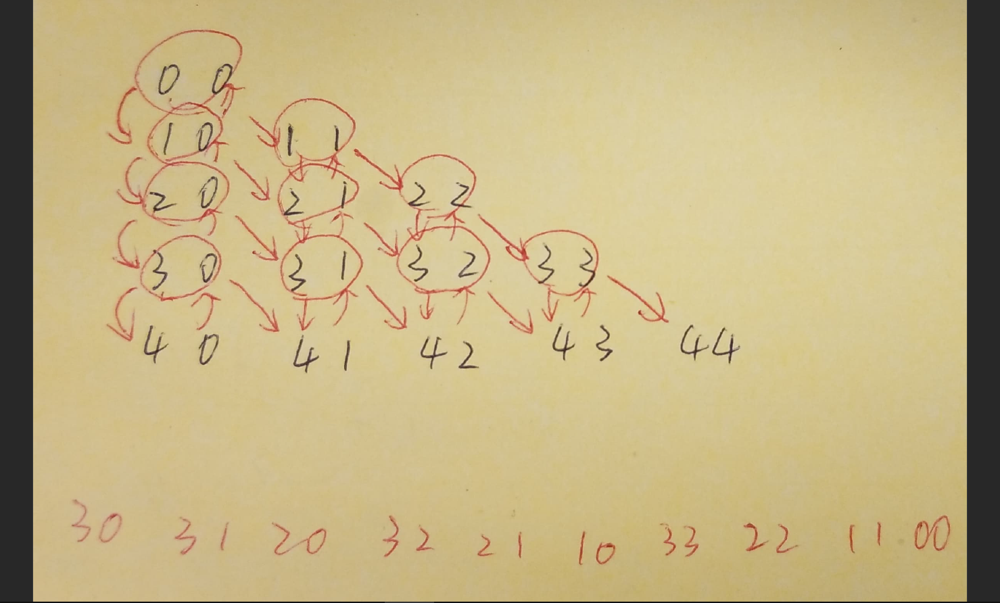

- Traversal
- DC
- DC with Memory: DP


### Python

```python
class Solution:
    def minimumTotal(self, triangle: List[List[int]]) -> int:
        '''Traversal'''
    #     self.minimum = sys.maxsize
    #     self.traverse(triangle, 0, 0, 0)
    #     return self.minimum
    
    # def traverse(self, triangle, x, y, path_sum):
    #     if x == len(triangle):
    #         self.minimum = min(path_sum, self.minimum)
    #         return

    #     self.traverse(triangle, x + 1, y, path_sum + triangle[x][y])
    #     self.traverse(triangle, x + 1, y + 1, path_sum + triangle[x][y])

        '''DC'''
    #     return self.divide_conquer(triangle, 0, 0)

    # def divide_conquer(self, triangle, x, y):
    #     if x == len(triangle):
    #         return 0
        
    #     left = self.divide_conquer(triangle, x + 1, y)
    #     right = self.divide_conquer(triangle, x + 1, y + 1)
    #     return min(left, right) + triangle[x][y]

        '''DC with Memory: DP'''
        return self.divide_conquer(triangle, 0, 0, {})

    def divide_conquer(self, triangle, x, y, memo):
        if x == len(triangle):
            return 0

        if (x, y) in memo:
            return memo[(x, y)]

        left = self.divide_conquer(triangle, x + 1, y, memo)
        right = self.divide_conquer(triangle, x + 1, y + 1, memo)

        memo[(x, y)] = min(left, right) + triangle[x][y]
        print(memo)
        return memo[(x, y)]
```


```

```
