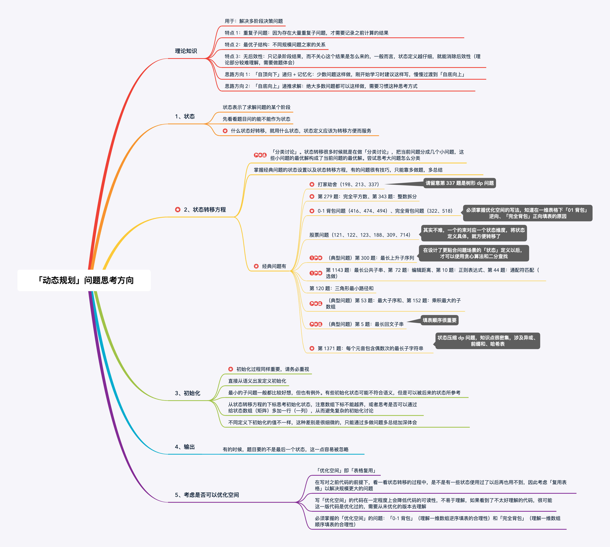
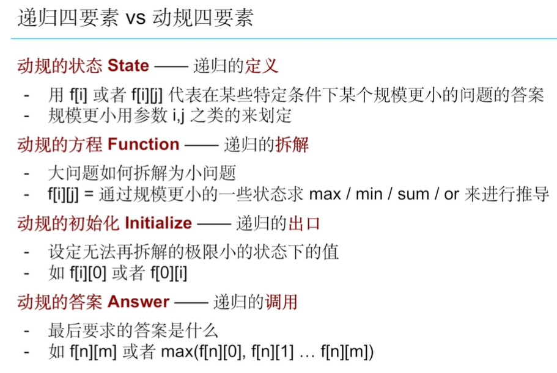
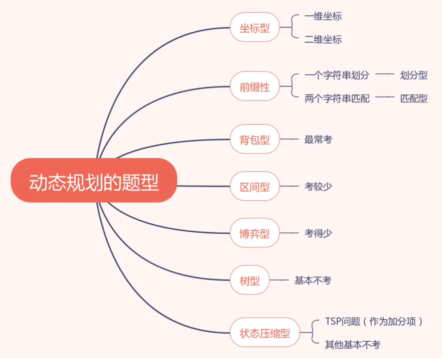

# 动态规划的实现方式

## 记忆化搜索
`记忆化搜索（Memoization） = 动态规划（DP）`  

记忆化搜索用搜索的方式实现了动态规划，是一种实现方式。非常适合解决博弈型动态规划。通过哈希表去重避免重复计算子问题。  

## 递推
for-loop

# 动态规划 vs 贪心法：  
DP为了长远利益损失当前利益；Greedy永远追求当前利益最大化。

# 动态规划 & 递归：四要素

# DP的使用场景

## 最值：最大/最小数
## 求可行性：是否存在一种方案
## 求方案总数：不关注具体方案

# DP的题型分类

