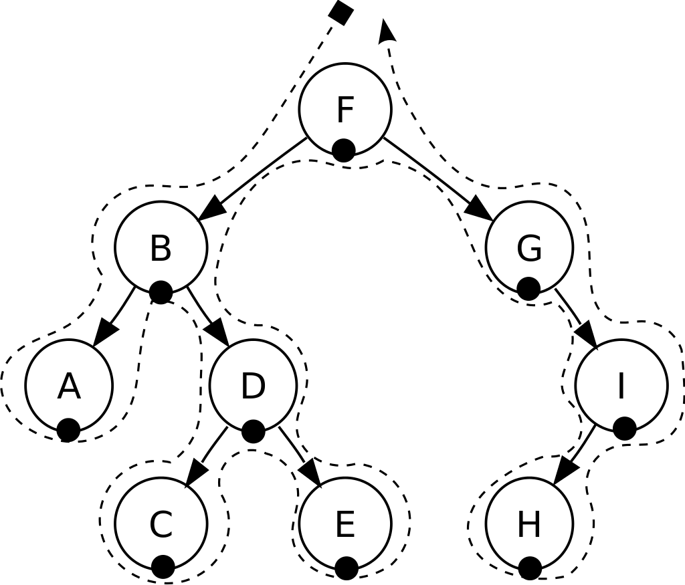
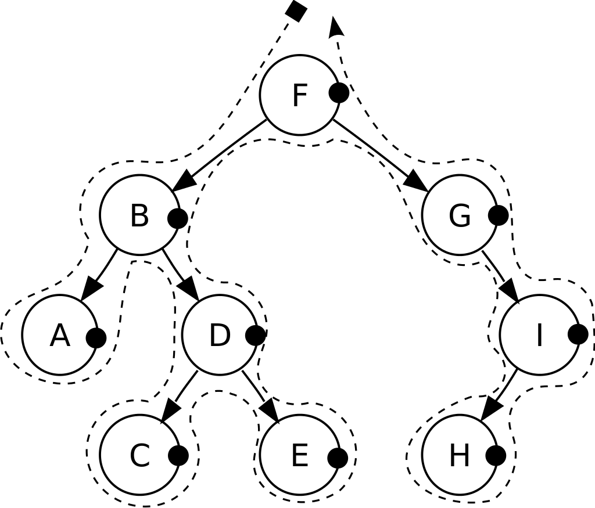
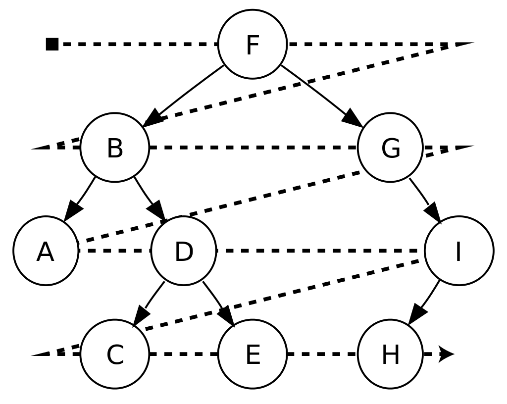

# Tree Traversals 
## Depth First Traversals (DFS):
- ***Preorder:*** root ---> left child ---> right child  
 F, B, A, D, C, E, G, I, H.  

- ***Inorder:*** left child ---> root ---> right child  
 A, B, C, D, E, F, G, H, I.  

- ***Postorder:*** left child ---> right child ---> root  
 A, C, E, D, B, H, I, G, F.  

## Breadth First Traversal (BFS):
- ***Level Order Traversal:*** level by level  
 F, B, G, A, D, I, C, E, H.  

Normally when we said "a given tree", the given list is in level-order-traversal. 

