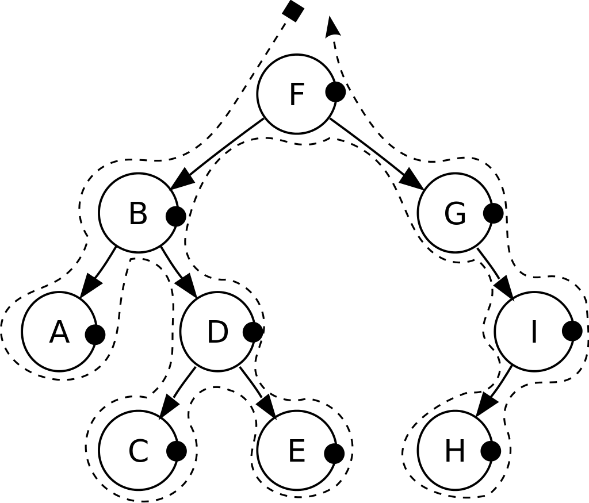

## Depth First Traversals (DFS):
- ***Preorder:*** root ---> left child(tree) ---> right child(tree)  
 F,| B, A, D, C, E,| G, I, H. 
```java
public void preOrderTraverse1(TreeNode root) {
		if (root != null) {
			System.out.print(root.val+"  ");
			preOrderTraverse1(root.left);
			preOrderTraverse1(root.right);
		}
	}
```


- ***Inorder:*** left child(tree) ---> root ---> right child(tree)  
 A, B, C, D, E,| F,| G, H, I.  
```java
public void inOrderTraverse1(TreeNode root) {
		if (root != null) {
			inOrderTraverse1(root.left);
			System.out.print(root.val+"  ");
			inOrderTraverse1(root.right);
		}
	}
```

- ***Postorder:*** left child(tree) ---> right child(tree) ---> root  
 A, C, E, D, B,| H, I, G,| F.  
```java

public void postOrderTraverse1(TreeNode root) {
		if (root != null) {
			postOrderTraverse1(root.left);
			postOrderTraverse1(root.right);
			System.out.print(root.val+"  ");
		}
	}
```

## Breadth First Traversal (BFS):
- ***Level Order Traversal:*** level by level  
 F,| B, G,| A, D, I,| C, E, H.  


Normally when we said "a given tree", the given list is in level-order-traversal. 

## Python program for different tree traversals 
### Iterative
```python
# A class that represents an individual node in a Binary Tree 
class Node: 
  def __init__(self,key):
    self.left = None
    self.right = None
    self.val = key 


# A function to do inorder tree traversal 
def printInorder(root): 
  if root: 
    # First recur on left child 
    printInorder(root.left) 
    # then print the data of node 
    print(root.val), 
    # now recur on right child 
    printInorder(root.right) 

# A function to do postorder tree traversal 
def printPostorder(root): 
  if root: 
    # First recur on left child 
    printPostorder(root.left) 
    # the recur on right child 
    printPostorder(root.right) 
    # now print the data of node 
    print(root.val), 

# A function to do preorder tree traversal 
def printPreorder(root): 
  if root: 
    # First print the data of node 
    print(root.val), 
    # Then recur on left child 
    printPreorder(root.left) 
    # Finally recur on right child 
    printPreorder(root.right) 


# Driver code 
root = Node(1) 
root.left = Node(2) 
root.right = Node(3) 
root.left.left = Node(4) 
root.left.right = Node(5) 
print("Preorder traversal of binary tree is")
printPreorder(root) 

print("Inorder traversal of binary tree is")
printInorder(root) 

print("Postorder traversal of binary tree is")
printPostorder(root) 

```

```
Preorder traversal of binary tree is
1 2 4 5 3 
Inorder traversal of binary tree is
4 2 5 1 3 
Postorder traversal of binary tree is
4 5 2 3 1
```
### Recursive
```python


```


## Java program for different tree traversals 
```java
// Java program for different tree traversals 

/* Class containing left and right child of current 
node and key value*/
class Node 
{ 
	int key; 
	Node left, right; 

	public Node(int item) 
	{ 
		key = item; 
		left = right = null; 
	} 
} 

class BinaryTree 
{ 
	// Root of Binary Tree 
	Node root; 

	BinaryTree() 
	{ 
		root = null; 
	} 

	/* Given a binary tree, print its nodes according to the 
	"bottom-up" postorder traversal. */
	void printPostorder(Node node) 
	{ 
		if (node == null) 
			return; 
		// first recur on left subtree 
		printPostorder(node.left); 
		// then recur on right subtree 
		printPostorder(node.right);
		// now deal with the node 
		System.out.print(node.key + " "); 
	} 

	/* Given a binary tree, print its nodes in inorder*/
	void printInorder(Node node) 
	{ 
		if (node == null) 
			return; 
		/* first recur on left child */
		printInorder(node.left); 
		/* then print the data of node */
		System.out.print(node.key + " "); 
		/* now recur on right child */
		printInorder(node.right); 
	} 

	/* Given a binary tree, print its nodes in preorder*/
	void printPreorder(Node node) 
	{ 
		if (node == null) 
			return; 
		/* first print data of node */
		System.out.print(node.key + " "); 
		/* then recur on left sutree */
		printPreorder(node.left); 
		/* now recur on right subtree */
		printPreorder(node.right); 
	} 

	// Wrappers over above recursive functions 
	void printPostorder() {	 printPostorder(root); } 
	void printInorder() {	 printInorder(root); } 
	void printPreorder() {	 printPreorder(root); } 

	// Driver method 
	public static void main(String[] args) 
	{ 
		BinaryTree tree = new BinaryTree(); 
		tree.root = new Node(1); 
		tree.root.left = new Node(2); 
		tree.root.right = new Node(3); 
		tree.root.left.left = new Node(4); 
		tree.root.left.right = new Node(5); 

		System.out.println("Preorder traversal of binary tree is "); 
		tree.printPreorder(); 

		System.out.println("\nInorder traversal of binary tree is "); 
		tree.printInorder(); 

		System.out.println("\nPostorder traversal of binary tree is "); 
		tree.printPostorder(); 
	} 
} 

```
