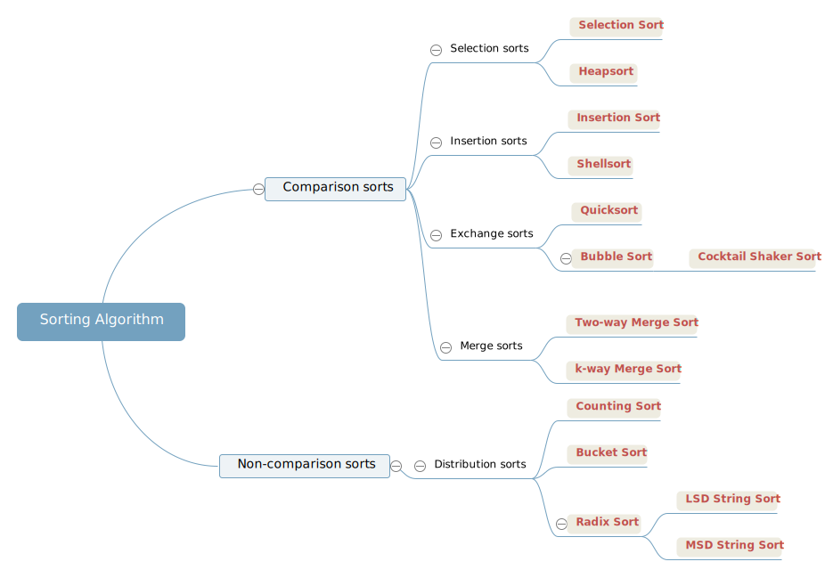

# Sorting Algorithms


# Selection Sorts
## Selection Sort
- Running time is insensitive to input
- Data movement is minimal (compare with bubble sort): the number of array access is a linear function of the array size
- Unstable


## Priority Queue & Heapsort
### Priority Queue
- **Unordered array representation**
  - Selecton sort
- **Ordered array representation**
  - Insertion sort
- **Binary heap representation**
  - Heapsort
  - MaxHeap and MinHeap
  - Heap-ordered: each node is larger than or equal to its two children (MaxHeap)
    - Largest key is at the root
    - The first entry ([0]) is empty
    - parent `k/2` :arrow_right: node `k` :arrow_right: children `2k`, `2k+1`
    - Height of a complete binary tree of size N: `lgN`

### Reheapifying algorithms
- **Bottom-up reheapify (swim)**: the priority of some node is increased, travel up
  - Exchanging the node with its parent 
- **Top-down reheapify (sink)**: the priority of some node is decreased, travel down
  - Exchanging the node with the *larger* of its two children

   
### Heapsort
- Breaks into 2 phases: `heap construction` and `sortdown`
  - **Heap construction**: 
    - From left to right: insert and `swim()`
    - From right to left: treat the array as a tree and directly use `sink()` for adjustment. More efficient because it starts halfway to skip subheaps of size 1
  - **Sortdown**: exchange the largest element (root) and the last entry :arrow_right: shrink the array :arrow_right: `sink()` to ensure heap-ordered :arrow_right: the whole array is ordered
- In-place
- Unstable

# Insertion Sorts
## Insertion Sort 
- Good for inserting elements
- Running time depends on the initial order of items in the input
- Efficient for partially sorted arrays
- Fine method for tiny arrays, better than quicksort
- Stable

## Shellsort
- A simple extension of insertion sort  
  - allowing exchanges of array entries that are far apart :arrow_right: produce partially sorted array :arrow_right: do insertion sort :arrow_right: gain speed
- Increment sequence
- Performs well on arrays in arbitrary order
- Useful for large arrays
- Unstable

# Exchange Sorts
## Bubble Sort
- Compares adjacent elements and swaps them if they are in the wrong order
 One-way swap
- `O(n^2)`
- Stable

### Cocktail Shaker Sort
- Extends bubble sort by operating in two directions: take turns
- Efficient for almost sorted arrays  
**Algorithm:**
Each iteration of the algorithm is broken up into 2 stages:  

The first stage loops through the array from left to right, just like the Bubble Sort. During the loop, adjacent items are compared and if value on the left is greater than the value on the right, then values are swapped. At the end of first iteration, largest number will reside at the end of the array.  
The second stage loops through the array in opposite direction- starting from the item just before the most recently sorted item, and moving back to the start of the array. Here also, adjacent items are compared and are swapped if required.  

```Java

```


## Quicksort
- Divide-and-conquer
- 利用pivot划分两半，先整体有序，然后再局部有序
- Shuffle and rearrange the array: put the partitioning item into its final position :arrow_right: `recursive calls`: finish the sort
- Uses few compares: the efficiency of the sort depends on how well the partitioning divides the array
- Requires time propotional to NlogN on average
- In-place, Unstable


# Merge Sort
- Divide-and-conquer
- 直接划分两半，先局部有序，然后再整体有序
- `Recursive calls`: break into 2 subarrays to be sorted :arrow_right: combine the ordered subarrays
- Guarantees to sort any array of N items in time propotional to NlogN
- Use extra space propotional to N
- Stable

## Top-down mergesort
- Recursive method
## Bottom-up mergesort
- Non-recursive

# Distribution Sorts
## Counting Sort

## Bucket Sort => double type

## Radix Sort => string sorts (LSD, MSD)


- In-place: transforms input using no auxiliary data structure  
冒泡排序、选择排序、插入排序、归并排序、快速排序、希尔排序、堆排序  

- Out-of-place: needs extra space to put the elements in as it's sorting them  
计数排序、桶排序、基数排序  

冒泡排序、选择排序、插入排序  
归并排序、快速排序、希尔排序、堆排序  
计数排序、桶排序、基数排序  
