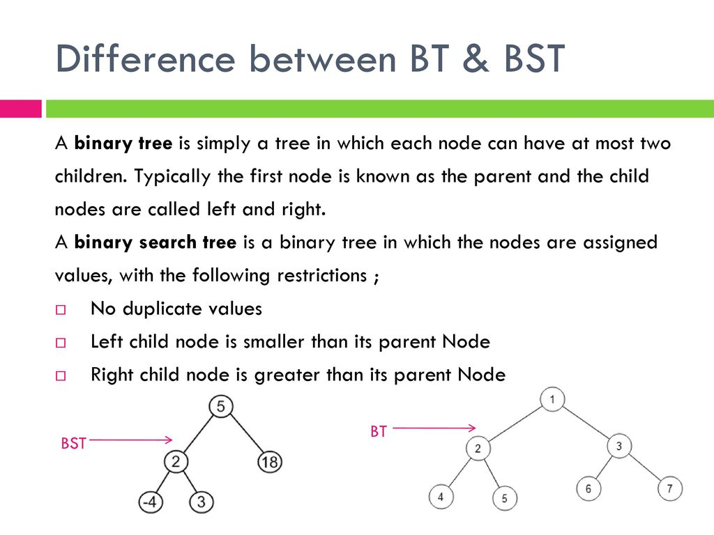

## BT:
The structure of binary tree is naturally suitable for recursive methods. Methods like DFS, BFS, Recursive and Iterative are included in for help understanding and exploring the idea of BT. 

## BST:
- **BST中最小的节点是从根节点一直往左走遇见的叶子节点**，不一定在树的最底层；
- **BST的特征就是中序遍历是严格递增的**
- 如果这棵BST是一条链，那么找到最小值节点的算法是O(n)的，除非这个BST是一个满二叉树。

## 二叉树的非递归后序遍历
> 借助栈来完成，遍历顺序为左、右、根。

1. 如果根节点非空，将根节点加入到栈中。
2. 如果栈不空，取栈顶元素（暂时不弹出），  
  a.如果（左子树已访问过或者左子树为空），且（右子树已访问过或右子树为空），则弹出栈顶节点，将其值加入数组，  
  b.如果左子树不为空，且未访问过，则将左子节点加入栈中，并标左子树已访问过。  
  c.如果右子树不为空，且未访问过，则将右子节点加入栈中，并标右子树已访问过。
3. 重复第二步，直到栈空。

### Java
```java
public ArrayList<Integer> postorderTraversal(TreeNode root) {
    ArrayList<Integer> result = new ArrayList<Integer>();
    Stack<TreeNode> stack = new Stack<TreeNode>();
    TreeNode prev = null; // previously traversed node
    TreeNode curr = root;
    if (root == null) {
        return result;
    }

    stack.push(root);
    while (!stack.empty()) {
        curr = stack.peek();
        if (prev == null || prev.left == curr || prev.right == curr) { // traverse down the tree
            if (curr.left != null) {
                stack.push(curr.left);
            } else if (curr.right != null) {
                stack.push(curr.right);
            }
        } else if (curr.left == prev) { // traverse up the tree from the left
            if (curr.right != null) {
                stack.push(curr.right);
            }
        } else { // traverse up the tree from the right
            result.add(curr.val);
            stack.pop();
        }
        prev = curr;
    }
    return result;
}
```
### Python
```python
class Solution:
    """
    @param root: A Tree
    @return: Postorder in ArrayList which contains node values.
    """
    def postorderTraversal(self, root):
        result = []
        stack = []
        prev, curr = None, root

        if not root:
            return result

        stack.append(root)
        while len(stack) > 0:
            curr = stack[-1]
            if not prev or prev.left == curr or prev.right == curr:  # traverse down the tree
                if curr.left:
                    stack.append(curr.left)
                elif curr.right:
                    stack.append(curr.right)
            elif curr.left == prev:  # traverse up the tree from the left
                if curr.right:
                    stack.append(curr.right)
            else:  # traverse up the tree from the right
                result.append(curr.val)
                stack.pop()
            prev = curr

        return result
```

